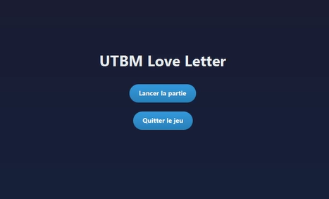
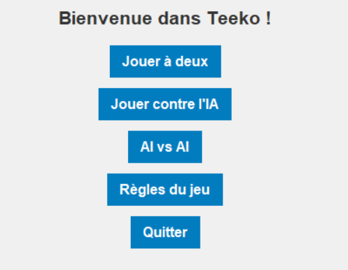
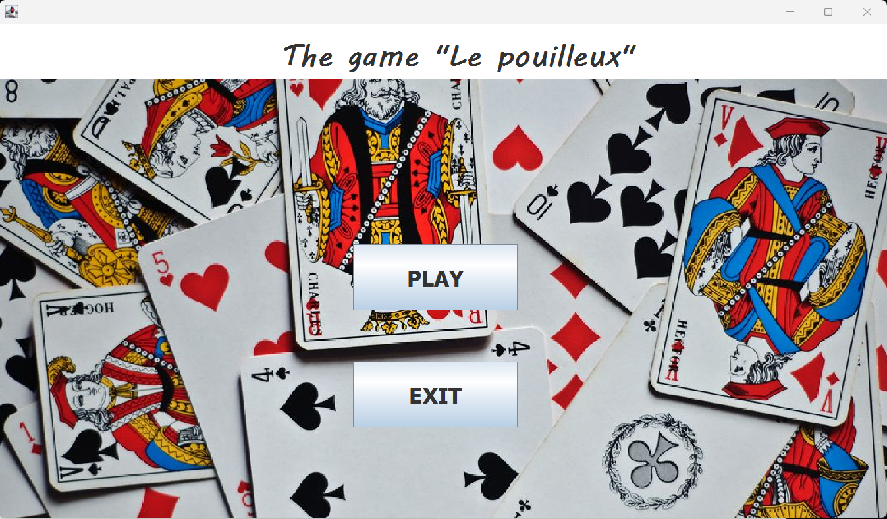
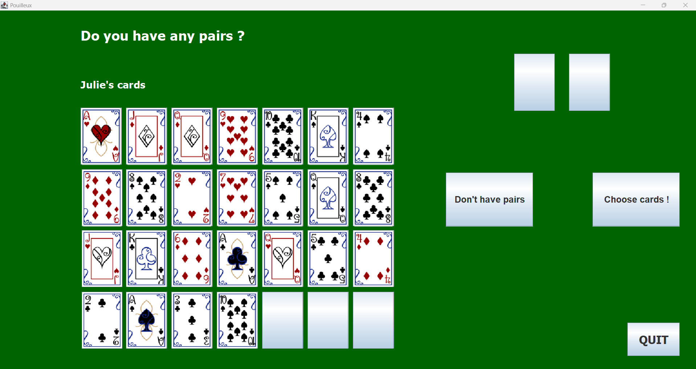

# 🚀 Projects

Here is a selection of my projects.

---

## 🚪 University Badge Access Simulation
Simulation of a badge-based access control system for a university campus.

I completed this project alone over 7 weeks during the first semester of my third year (Bachelor +3).

After a first experience with Object-Oriented Programming (OOP), this project helped me improve my knowledge and strengthen my skills in this area. Even though I enjoy teamwork, I was very satisfied to successfully complete a full project independently.

**Technologies:** C++ · CMake  
👉 check the project [here](https://github.com/Ahmedooun/Gestion_Porte_Universite_Project)

---

## 💌 Love Letter – UTBM Edition

Java implementation of the *Love Letter* card game adapted to the UTBM environment.

This project was completed in a team of three over 8 weeks during the first semester of my third year (Bachelor +3).

UML design was very important for this project. With my team, we focused on modeling and structuring the program before coding. I enjoyed this project a lot because developing a game is always exciting — and we could play it once it was finished!

**Technologies:** Java  
👉 check the project [here](https://github.com/Ahmedooun/LoveLetterUTBM_Project)

---

## 🎮 Teeko – Strategy Game with AI

Python implementation of the Teeko strategy game with a Tkinter GUI and an AI based on Minimax with Alpha-Beta pruning.

This project was completed in a group of four over 10 weeks during the first semester of my third year (Bachelor +3).

It allowed me to understand and learn the basics of Artificial Intelligence using Prolog. What I liked the most was learning more about AI, a field that interests many people. Developing a game while learning AI concepts made the experience even more rewarding.

**Technologies:** Python · Tkinter · Minimax  
👉 check the project [here](https://github.com/Jlcht/Teeko)

---

## 🔧 Elevator System Simulation
Simulation of an elevator management system in C using processes, threads, and IPC mechanisms.

This project was completed in a team of three over 9 weeks during the first semester of my third year (Bachelor +3).

It helped me improve my understanding of system programming. I found it technically challenging, but working as a team allowed us to deliver a well-structured and solid project.

**Technologies:** C · Threads · IPC  
👉 check the project [here](https://github.com/Ahmedooun/SY40-Project-Ascenseurs)

---

## 🃏 Le Pouilleux

Java implementation of the card game “Le Pouilleux”.

This project was completed in a team of three over 8 weeks during the second semester of my second year (Bachelor +2).

It was my first real experience with Object-Oriented Programming. Developing a game is always fun, but this project helped me better understand important concepts such as polymorphism, class inheritance, and abstraction.

**Technologies:** Java  
👉 check the project [here](https://github.com/Ahmedooun/Le_Pouilleux_Project)

---

## ☀️ Mobile Solar Panel
Arduino project focused on optimizing the orientation and efficiency of a mobile photovoltaic panel.

This project was completed in a team of three over 8 weeks during the first semester of my second year (Bachelor +2).

It helped me understand how sensors work and how to program them with Arduino. Even though I really enjoyed the project, the wiring part was quite challenging. My teammates and I spent a lot of time working on it, but despite the difficulties, the project remained very interesting and motivating.

**Technologies:** Arduino · Sensors  
👉 check the project [here](https://github.com/Ahmedooun/Panneau_solair_mobile_Project)

---

## 🌍 Travel Agency Website
Travel agency website developed in PHP with SQL database integration.

This project was completed in pairs over 8 weeks during the first semester of my second year (Bachelor +2).

It was my first experience with web development. What I really enjoyed was creating my first dynamic website with a database and, most importantly, understanding how everything works together.

**Technologies:** PHP · HTML/CSS · SQL  
👉 check the project [here](https://github.com/Ahmedooun/Travel_Agency_Project)

